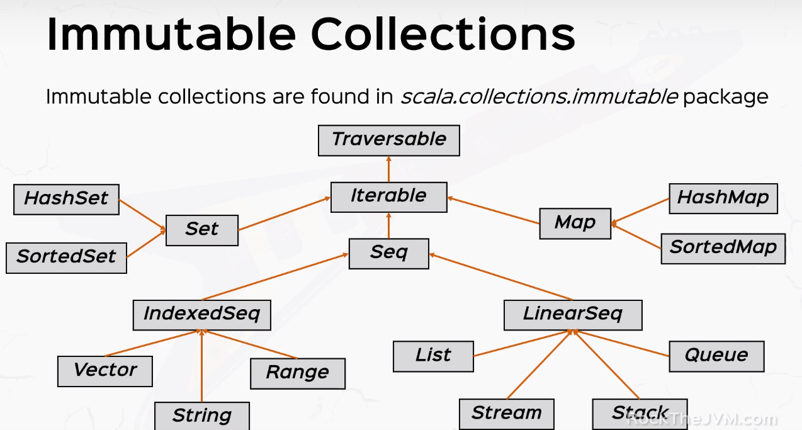

* Scala offers mutable and immutable collections.
* We are using immutable by default in Scala.

# Immutable Collections
* Available in scala.collections.immutable package.

<br/> 

# Mutable Collections
* Available in scala.collections.mutable package.

<br/> 

# Sequences
```
  val aSequence = Seq(1,3,2,4)
  println(aSequence)
  println(aSequence.reverse)
  println(aSequence(2))
  println(aSequence ++ Seq(7,5,6))
  println(aSequence.sorted)

  // Ranges
  val aRange: Seq[Int] = 1 until 10
  aRange.foreach(println)

  (1 to 10).foreach(x => println("Hello"))
```

# List
```
  // lists
  val aList = List(1,2,3)
  val prepended = 42 +: aList :+ 89
  println(prepended)

  val apples5 = List.fill(5)("apple")
  println(apples5)
  println(aList.mkString("-|-"))
```

# Arrays
```
// arrays
  val numbers = Array(1,2,3,4)
  val threeElements = Array.ofDim[String](3)
  threeElements.foreach(println)

  // mutation
  numbers(2) = 0  // syntax sugar for numbers.update(2, 0)
  println(numbers.mkString(" "))

  // arrays and seq
  val numbersSeq: Seq[Int] = numbers  // implicit conversion
  println(numbersSeq)
```

# Vectors
```
  // vectors
  val vector: Vector[Int] = Vector(1,2,3)
  println(vector)

  val numbersList = (1 to maxCapacity).toList
  val numbersVector = (1 to maxCapacity).toVectors
```

# Tuples
```
 // All of are the same definition.
 val aTuple = (2, "hello, Scala")  // Tuple2[Int, String] = (Int, String)
 val aTuple = new Tuple(2, "hello, Scala")
 val aTuple = Tuple(2, "hello, Scala")

 ```

 # Maps

```
   val aMap: Map[String, Int] = Map()

  val phonebook = Map(("Jim", 555), "Daniel" -> 789, ("JIM", 9000)).withDefaultValue(-1)
  // a -> b is sugar for (a, b)
  println(phonebook)

  // map ops
  println(phonebook.contains("Jim"))
  println(phonebook("Mary"))

  // add a pairing
  val newPairing = "Mary" -> 678
  val newPhonebook = phonebook + newPairing
  println(newPhonebook)
```